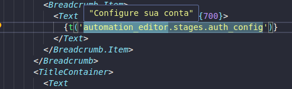

# i18n Magic (VSCode Extension)

The i18n Magic extension is a tool for VSCode that helps you to visualize your i18n files content.
When we are working with i18n files, we usually have a lot of keys and values, and it's hard to know what is the value of each key.
This extension helps you to visualize the content of your i18n files, making your days funny and your life easier.

## Features

Hover over a key inside Translate function (`t`) or Translate componet(`Trans i18nKey`) to see the value of that key.

## Requirements

Your project must have the i18n files in the `public/static/locales/` folder.
